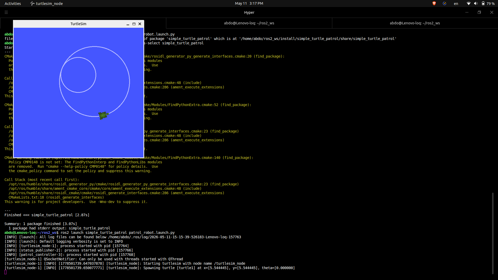
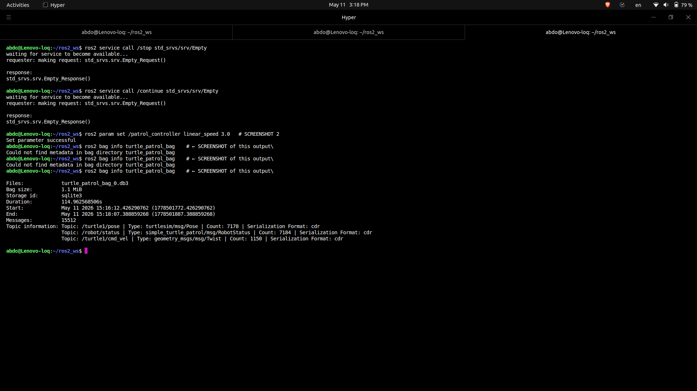
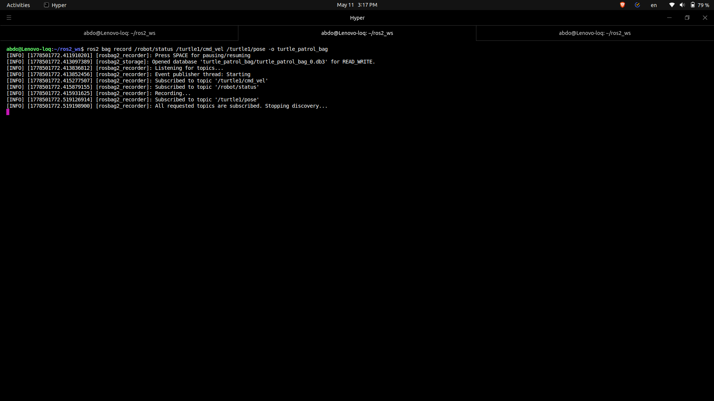

# Simple Turtle Patrol - ROS 2 Package

A ROS 2 package that makes a turtle move in continuous circles with stop/continue
services and a custom status message.

## Package Structure

```
simple_turtle_patrol/
├── msg/
│   └── RobotStatus.msg       # Custom message
├── params/
│   └── patrol_params.yaml    # Speed and rate parameters
├── launch/
│   └── patrol_robot.launch.py
├── src/
│   ├── patrol_controller.cpp # Circle movement + services
│   └── status_publisher.cpp  # Status reporting
├── CMakeLists.txt
└── package.xml
```

## Custom Message (RobotStatus.msg)

```
geometry_msgs/Pose2D pose   # x, y, theta
string state                # "running" or "stopped"
float32 temperature         # dummy temperature value
int32 lap_count             # completed full circles
```

## Nodes

| Node | Role |
|---|---|
| `turtlesim_node` | Renders the turtle simulation |
| `patrol_controller` | Moves turtle in circle, provides /stop and /continue |
| `status_publisher` | Publishes /robot/status at configured rate |

## Topics & Services

| Name | Type | Direction |
|---|---|---|
| `/turtle1/cmd_vel` | `geometry_msgs/Twist` | Published by patrol_controller |
| `/turtle1/pose` | `turtlesim/Pose` | Subscribed by status_publisher |
| `/robot/status` | `RobotStatus` | Published by status_publisher |
| `/stop` | `std_srvs/Empty` | Service → stops turtle |
| `/continue` | `std_srvs/Empty` | Service → resumes turtle |

## Parameters (patrol_params.yaml)

```yaml
patrol_controller:
  ros__parameters:
    linear_speed: 1.5    # m/s - controls circle radius
    angular_speed: 1.0   # rad/s
```

## Build & Run

```bash
# Build
cd ~/ros2_ws
colcon build --symlink-install --packages-select simple_turtle_patrol
source install/setup.bash

# Launch
ros2 launch simple_turtle_patrol patrol_robot.launch.py
```

## Usage

```bash
# Stop the turtle
ros2 service call /stop std_srvs/srv/Empty

# Resume movement
ros2 service call /continue std_srvs/srv/Empty

# Change circle radius at runtime (no rebuild needed)
ros2 param set /patrol_controller linear_speed 3.0

# Monitor status
ros2 topic echo /robot/status
```

## Demo

### Turtle Moving in Two Different Circle Sizes
The turtlesim window shows the turtle path.
- Small circle: default `linear_speed=1.5`
- Large circle: after `ros2 param set /patrol_controller linear_speed 3.0`



---

### Stop & Continue Services + Parameter Change
Calling `/stop`, `/continue`, and changing `linear_speed` at runtime.



---

### Bag Recording
Recording `/robot/status`, `/turtle1/cmd_vel`, `/turtle1/pose` topics.



## Bag Recording

```bash
# Record topics
ros2 bag record /robot/status /turtle1/cmd_vel /turtle1/pose -o turtle_patrol_bag

# Verify contents
ros2 bag info turtle_patrol_bag
```

The recorded bag captures:
- ✅ Turtle moving in circle (running state)
- ✅ Turtle stopped via `/stop` service
- ✅ Turtle resumed via `/continue` service  
- ✅ Circle radius change via parameter update
