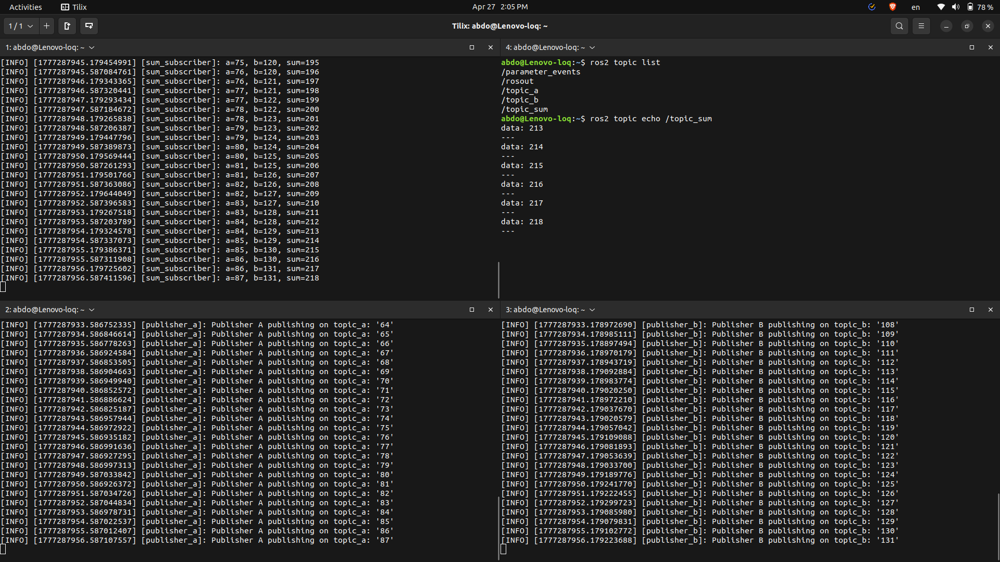

# Task1 - ROS 2 Publisher Subscriber Sum Example

A ROS 2 Humble package demonstrating multi-node communication with publishers and subscribers.

## Description

This package contains three nodes that work together:

| Node | Purpose |
|------|---------|
| `publisher_a` | Publishes Int32 messages on `/topic_a` |
| `publisher_b` | Publishes Int32 messages on `/topic_b` |
| `sum_subscriber` | Subscribes to both topics, computes sum, publishes on `/topic_sum` |

## Architecture

```
┌─────────────┐          ┌─────────────────┐
│ publisher_a │──/topic_a──►│                 │
└─────────────┘          │  sum_subscriber  │──/topic_sum──►
┌─────────────┐          │                 │
│ publisher_b │──/topic_b──►│                 │
└─────────────┘          └─────────────────┘
```

## Dependencies

- ROS 2 Humble
- rclcpp
- std_msgs

## Build

```bash
cd ~/ros2_ws
colcon build --packages-select task1_cpp
source install/setup.bash
```

## Run

Open three terminals and run:

**Terminal 1:**
```bash
source ~/ros2_ws/install/setup.bash
ros2 run task1_cpp publisher_a
```

**Terminal 2:**
```bash
source ~/ros2_ws/install/setup.bash
ros2 run task1_cpp publisher_b
```

**Terminal 3:**
```bash
source ~/ros2_ws/install/setup.bash
ros2 run task1_cpp sum_subscriber
```

## Topics

| Topic | Message Type | Description |
|-------|--------------|-------------|
| `/topic_a` | std_msgs/msg/Int32 | Values from publisher_a |
| `/topic_b` | std_msgs/msg/Int32 | Values from publisher_b |
| `/topic_sum` | std_msgs/msg/Int32 | Sum of a + b |

## Verify Topics

```bash
# List all topics
ros2 topic list

# Echo the sum topic
ros2 topic echo /topic_sum
```

## Files Structure

```
task1_cpp/
├── output.png
├── CMakeLists.txt
├── package.xml
├── README.md
├── include/
│   └── task1_cpp/
└── src/
    ├── publisher_a.cpp
    ├── publisher_b.cpp
    └── sum_subscriber.cpp
```
## output



## Author

Abdelfattah